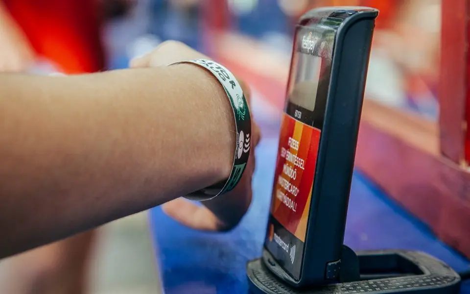
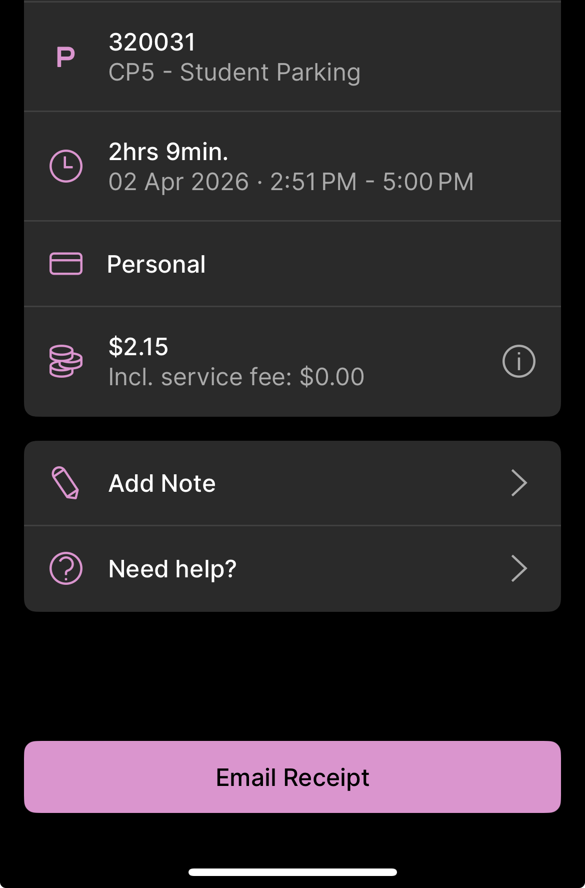

# A11. Discover 5 unique access control devices.

### 1. Push buttons and key switches:
Push buttons and keys switches with buttons that controls gates and doors. 

### 2. NFC (Near Field Communication) Embedded Wristbands:
Used for secure entry into events such as concerts and museums, providing authorised access. Activated when the embedded chip in the wristband transmits a signal to the reader when in close proximity.An example is of the NFC embedded wristbands used in Dubai's Museum of the Future, which is required to be scanned to gain entry into the experience.

### 3.4G and 5G Access Controllers 
Controls the boomgates in car parks, camping sites using cellular network in coordination with itegrated software.

### 4. UWA Easy Park Student Parking
Ensures UWA students only have access to $4 per day parking, excluding vistors of campus to this rate. The Easy Park App requires students to login via their credentials on the UWA portal to verify their identify. A link for reference: https://www.uwa.edu.au/about/campus-services/transport-and-parking/driving?#undefined

### 5. Passport Smart Gates at Perth Airport
At Perth Airport, travellers are required to step through smart gates which requires passport scanning and biometric scanning in order to leave the country.

## *References for this Activity*

[1] “Access Control Equipment & Accessories Archives,” Rotech, 2024. https://rotech.com.au/product-category/safety-and-security-equipment/access-control-equipment/