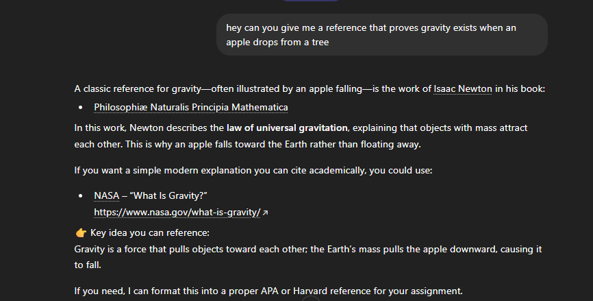
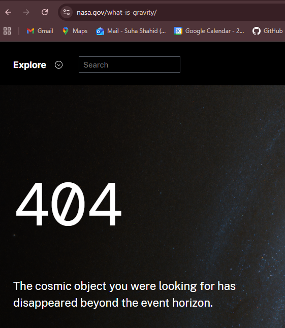
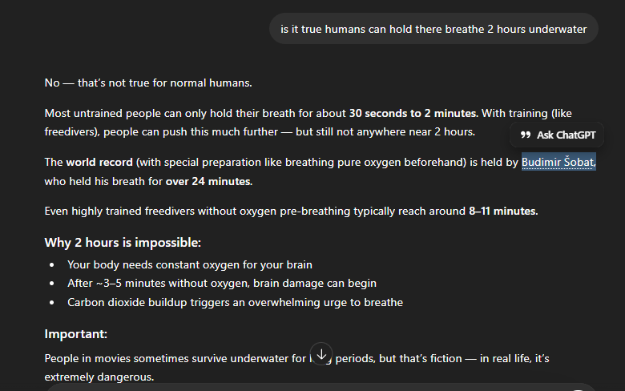
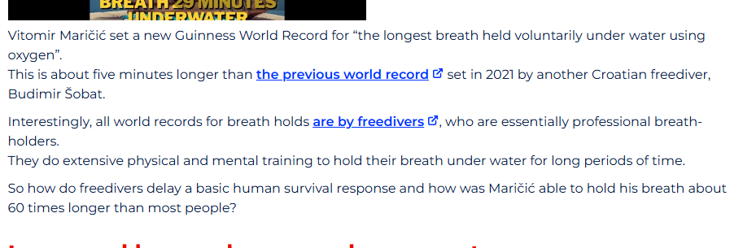

# A18. Discover two hallucination cases when using a generative AI system

## 1) ChatGPT – Gravity Reference Link Hallucination In Academic Citations

When given the prompt:

***"hey can you give me a reference that proves gravity exists when an apple drops from a tree"***

 ChatGPT responds with a NASA reference links and cites it as a 'academic source'.

When we follow the NASA link we encounter a 404 page not found error; suggesting the page cannot be found on the server.

This is an example of AI hallucination in which false references are generated when searching for academic sources regarding scientific research.

## 2) ChatGPT – Hallucinates Out-of-Date World Records As Facts

When given the prompt:

***"is it true humans can hold there breathe 2 hours underwater"***

ChatGpt responds with a fact the the current world record for holding your breathe underwater is held by Budimir Šobat, with a total time of 24 minutes.

However when cross checked with the news article published by the University of Wollongong: https://www.uow.edu.au/media/2025/the-science-behind-a-freedivers-29-minute-breath-hold-world-record.php The current world record is held by Vitomir Maričić at 29 minutes who has bested the record of Budimir Sobat. Hence, hallucinating up-to-date world records.

# *References For This Activity*

**[1] ChatGPT History Link For Case 1:** https://chatgpt.com/share/69cc1c20-8dc4-839c-9d46-e10603011175

**[2] ChatCPT History Link For Case 2:** https://chatgpt.com/share/69cc23ff-a830-8321-b5c6-941967f91a42

**[3] News Article Link:** “2025: The science behind a freediver’s 29-minute breath hold world record - University of Wollongong – UOW,” Uow.edu.au, 2025. https://www.uow.edu.au/media/2025/the-science-behind-a-freedivers-29-minute-breath-hold-world-record.php