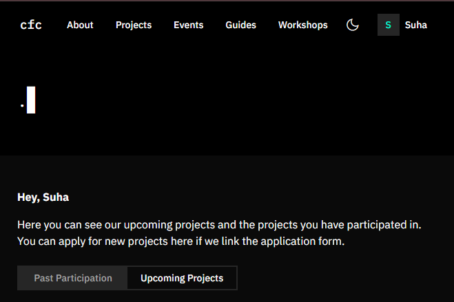

# A19) Join a CS/DS/cybersecurity club

## Club: Coders for Causes (CFC)
- **Website:** https://codersforcauses.org/
- **Type:** A student run not-for-profit club that is based in Crawley, Perth Western Australia.
- **What they do:** University students are connected with different charity organisatiosn to build technical solutions

## Joining Coders for Causes (CFC)
I joined the club on the 31/03/2026 via their webpage: https://codersforcauses.org/ 

### Club Registration With CFC: 

**Entering my details:**

**Evidence of account creation:**
My dashboard:

My profile:
