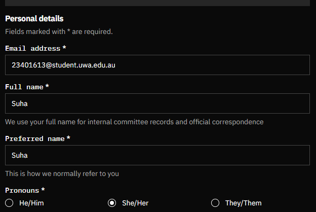
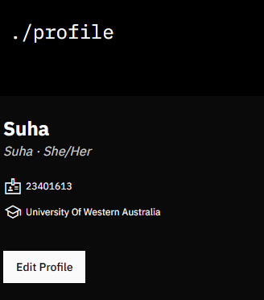

# A19. Join a CS/DS/Cybersecurity Club

## Club: Coders for Causes (CFC)

- **Website:** https://codersforcauses.org/  
- **Type:** A student-run not-for-profit club based in Crawley, Perth, Western Australia.  
- **What they do:** University students are connected with different charity organisations to build technical solutions.

## Joining Coders for Causes (CFC)

I joined the club on 31/03/2026 via their webpage:  
https://codersforcauses.org/

## Club Registration with CFC

### Entering My Details

### Evidence of Account Creation

**My dashboard:**

**My profile:**

