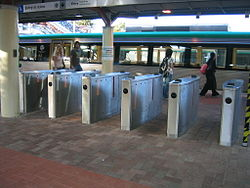

# Security Concepts Used in Public Spaces

## 1) Transperth SmartRider Entry/Exit Points

SmartRider card entry and exit gates control access to trains at various Perth stations. They authenticate SmartRider users using the service and prevent fare evasion; essentially acting as access control.They also audit tracking information for security purposes and real-time monitoring.

## 2) Security Tag Detection in Shopping Centres

Secuirty tags placed on merchandise trigger alarms if stolen items pass through exit sensors. This system reduces theft and alerts security staff in real-time.

## 3) Public CCTV And Public Surveillance Used in Perth City

Perth City contains an intensive network of 800 cameras that are monitored 24/7 by WA Police and surveillance operators. Furthermore the City employs rangers,cleaners,parking patrols that coordinate and communicate with it's surveillance centre. [2]

## 5) Fire Alarms
Fire alarms located in shopping centres and libraries detect smoke or heat and immediately alert occupants and alert for emergency evacuation; providing security by protecting people and infrastructure.

## *References For This Activity*

[1] Wikipedia Contributors, “SmartRider,” Wikipedia, Mar. 19, 2026. https://en.wikipedia.org/wiki/SmartRider

[2] “City Watch | Community Safety & Surveillance,” perth.wa.gov.au. https://perth.wa.gov.au/community/community-services-and-facilities/security-and-surveillance
