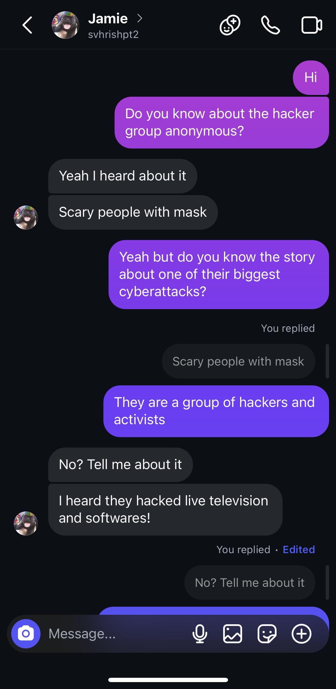
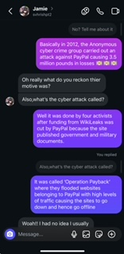
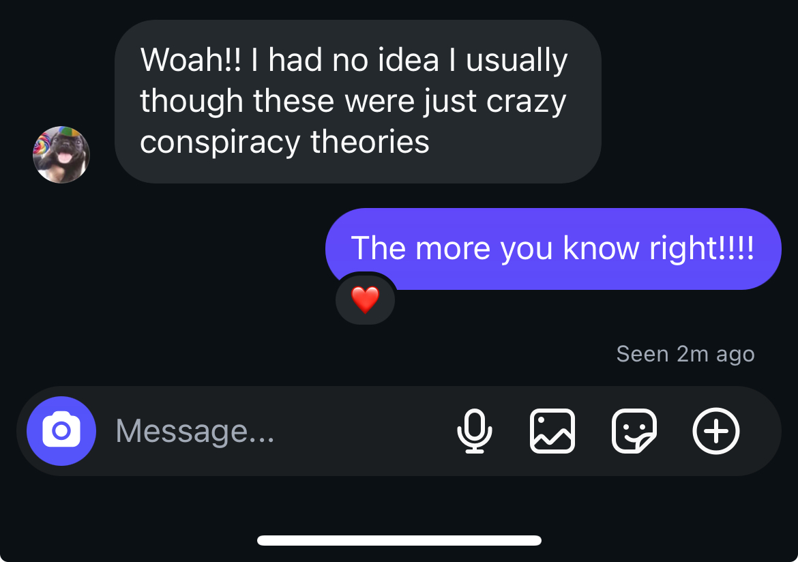

#  A20. Participate in a discussion with your friends about cybersecurity event.

## Discussing 'Operation Payback' Cyber Attack With My Friend Jamie

*Screenshots of my discussion with Jamie:*

A discussion revolving 'Operation Payback' a major cyberattack carried out by the hacker group 'Anonymous' in 2012. The attack was carried out as payback against companies such as PayPal,Mastercard and Visa due to cut funding from the site WikiLeaks. The group flooded websites belonging to these companies with extremely high levels of traffics causing the sites to go offline [1]

# *References For This Activity*
[1] S. Laville, “Anonymous cyber-attacks cost PayPal £3.5m, court told,” The Guardian, Nov. 22, 2012. Available: https://www.theguardian.com/technology/2012/nov/22/anonymous-cyber-attacks-paypal-court