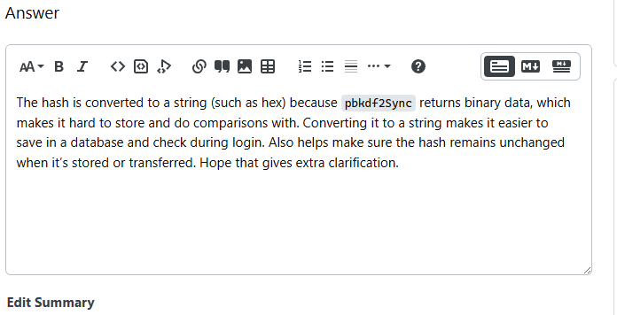
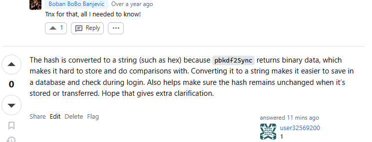

# A21. Participate in an online cybersecurity discussion

## Overview:

I participated in a cybersecurity discussion on Stack Overflow which discussed the conversion of hashes from passwords hashed using the 'pbkdf2Sync' library function into strings.By doing so, it allows efficient storage in databases and quick login checks.Hence by responding to this question, I provide extra context and understanding to the discussion.

***Link to Stack Overflow Discussion: https://stackoverflow.com/questions/60107757/why-do-we-do-tostringhex-after-crypto/79918022#79918022***

### Evidence Of Participation:

***Writing and publishing the post:***
    
    
