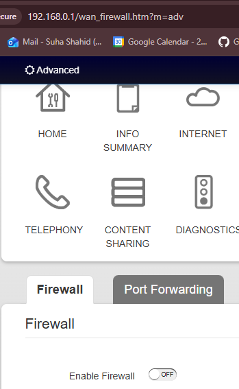
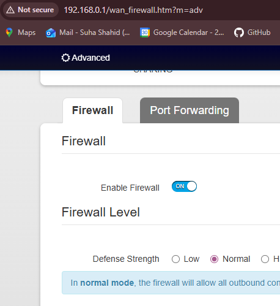

# A23. Enhance the cybersecurity at your home.

## Turning on the Firewall for my Network:

By enabling the Firewall on my home network to the 'normal' level, it acts as a front line defense against unauthorised access, halts interactions with unsecured networks and monitors ingoing/outgoing traffic all while protecting our devices.

### Evidence of Switching 'On' The Firewall

***Previous State***

***Enabling the Firewall***
