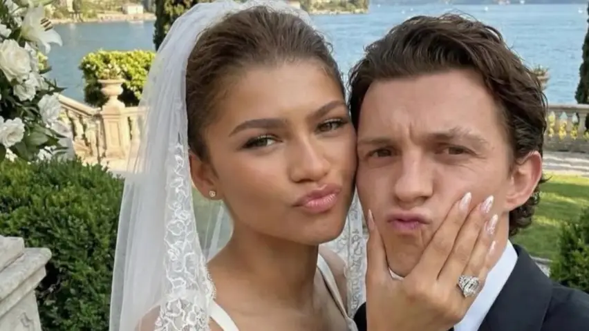
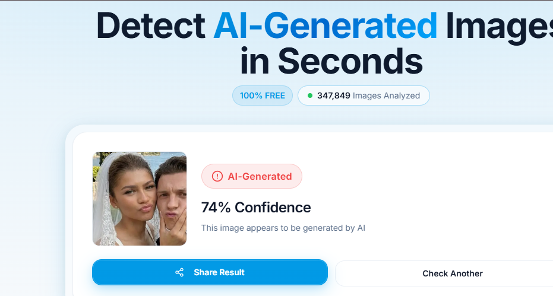

# A29. Find a publicly available AI-generated image, video, or audio clip, and use at least one detection or verification tool to analyse it

A popular AI image that I have found is the currently circulating image of Tom Holland and Zendaya's wedding pictures. 

***AI Generated Image For Reference***

###  Chosen Detection Tool
I used this website to check the image for AI detection:  
https://isthisai.com/

### Evidence of Verification Tool

### Result Summary

The detection tool is 74% confident that the image is AI-generated. This suggests that the image is likely not real. Although it is not 100% confident, it indicates that verification tools can experience difficulty in detecting AI-generated images when they appear realistic.