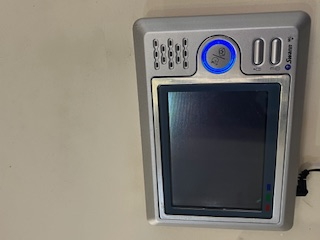
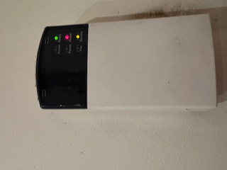
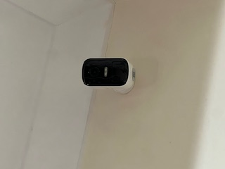

# A3. Discover security concepts used in your house

## Security Concepts Found Inside My House

1) Telestra Wifi 

My house uses a Telestra Modem and Wifi, which requires a username and password to gain access to the secured network.

2) Doorbell camera 

The doorbell camera as a entry point surveillance allowing individuals to be screened before they enter the house; improving safety.

3) House Alarms 

Fascilatated by multiple motions sensors placed inside the house, unauthorised access/forced entry triggers the security alarm to be activated and automatically dials the defualt phone number to alert of intruders.

4) Eufy Security Cameras 

 Eufy security cameras are placed in and outside the home to monitor surveillance in the case of intruders/robberies.