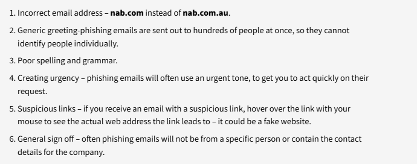
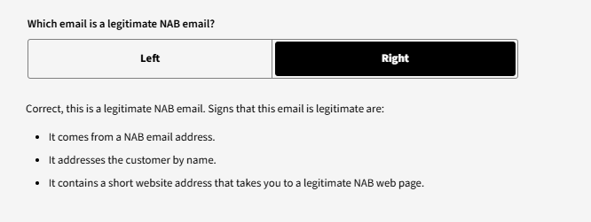
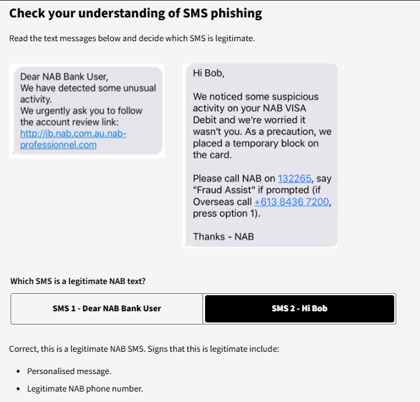
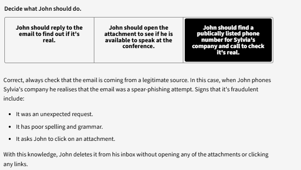
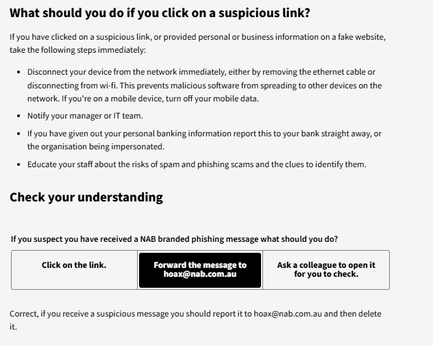
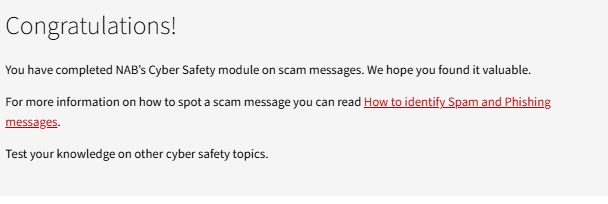

# A30. Complete an online cybersecurity module.

## About the completed training module:

I completed the NAB ***Introduction: how to spot scam messages*** which helps identify spam and phishing scams and prevent loss of information. The module helps individuals recognise and handles such attacks by:

1) Helping the individual to recognise a suspicious message that is likely to be spam or phishing attempt

2) What actions should be undertaken

3) Incident reporting and location of cybersecurity resources.

## Evidence of my engagement

###### Evidence of Checking My Understanding

Managing Spam:

Reading up on the 6 suspicious signs of email phishing and checking my understanding:

Checking my understanding of SMS phishing:

Checking my understanding of Spear Phishing:

Checking by understanding of what to do when clicking on a suspicious link:

## Evidence of Module Completion:

## *References For This Activity*
[1] “Introduction: how to spot scam messages,” Nab.com.au, 2026. https://www.nab.com.au/about-us/security/cyber-safety-training-modules/spam-and-phishing (accessed Apr. 01, 2026).