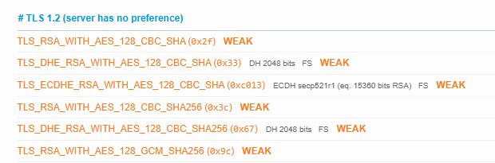
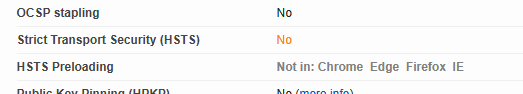
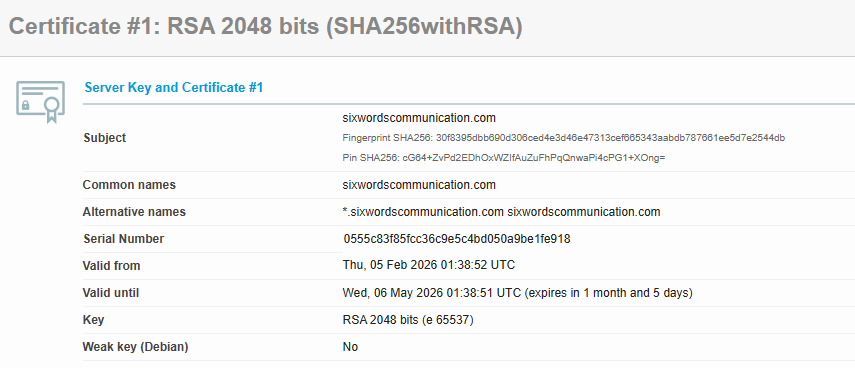
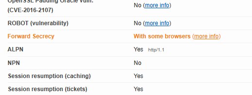

# A4. Discover a vulnerable website

## Vulnerable Website Discovered

I conducted SSL/TLS configuration check on the *vulnerable Website: sixwordscommunication.com* using SSL Labs.

## Evidence of Vulnerability

The SSL test revealed the following issues:
- TLS 1.2 is supported with weak cipher suites (AES-CBC, RSA key exchange): 

  

- HSTS (Strict Transport Security) is not enabled:

   

    - Certificate expires soon (on the 06 May 2026):

- Forward Secrecy only partially supported by some browsers:

  

## Summary

The website is vulnerable due to weak TLS 1.2 ciphers, missing HSTS, and a soon-to-expire certificate, which could allow attackers to perform Man-In-The-Middle attacks or downgrade the connection to an insecure protocol.