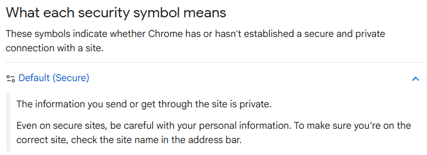

# A5. Discover Cryptographic Implementation Used Online

## Cryptographic Implementation Chosen: HTTPS (TLS/SSL Encryption)

HTTPS (Hypertext Transfer Protocol) is a protocol used to securely transmit data between a browser and website. It uses *TLS (Transport Layer Security)* to encrypt sensitive data and prevent interception by attackers.  

*A fairly simple example is when visting **https://www.google.com**, your connection is encrypted with TLS, ensuring secure browsing when entering personal information such as credit card numbers. This is indicated by the padlock symbol*

## *References for This Activity*
[1] “Check if a site’s connection is secure - Computer - Google Chrome Help,” Google.com, 2019. https://support.google.com/chrome/answer/95617?visit_id=639106177674073414-1542495751&p=ui_security_indicator&rd=1#zippy=%2Cdefault-secure (accessed Apr. 01, 2026).
