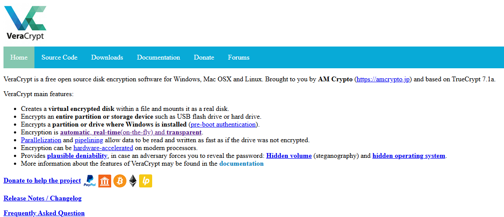

# A6. Discover Cryptographic Implementation Used Offline

## Chosen Offline Cryptographic Tool: VeraCrypt

VeraCrypt is a free, open-source encryption software for Windows, macOS, and Linux.It encrypts files, partitions, or entire drives in order to protect data from unauthorised access by attackers.Encryption happens instantly without slowing down system performance.The platform also offers hidden operating systems for extra privacy [1]

*Image of the VeraCrypt site for reference:*

## *References for This Activity*
[1] “VeraCrypt - Free Open source disk encryption with strong security for the Paranoid,” Veracrypt.io, 2025. https://veracrypt.io/en/Home.html