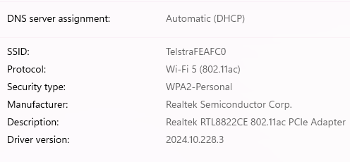

# A7. Discover Cryptography Used in Modern Networks

## An Example Of Cryptography: WPA3 (Wi-Fi Protected Access 3)

WPA3 is the most up-to-date and strongest Wi-Fi security protocol. It provides encryption for passwords and authentication methods. WPA3 introduces **forward secrecy**, which ensures that past transmissions remain secure even if the keys in the current session are compromised.

*A simple example is connecting to a public Wi-Fi network that uses WPA3, where browsing data is immediately encrypted.* 

In the image below my personal network uses WPA2-Personal which could be upgraded to WPA3 to improve security:

### *References for This Activity*

[1] MalwareBytes, “All you need to know about credential stuffing attacks.,” Malwarebytes, Apr. 30, 2025. https://www.malwarebytes.com/cybersecurity/basics/what-is-wpa3